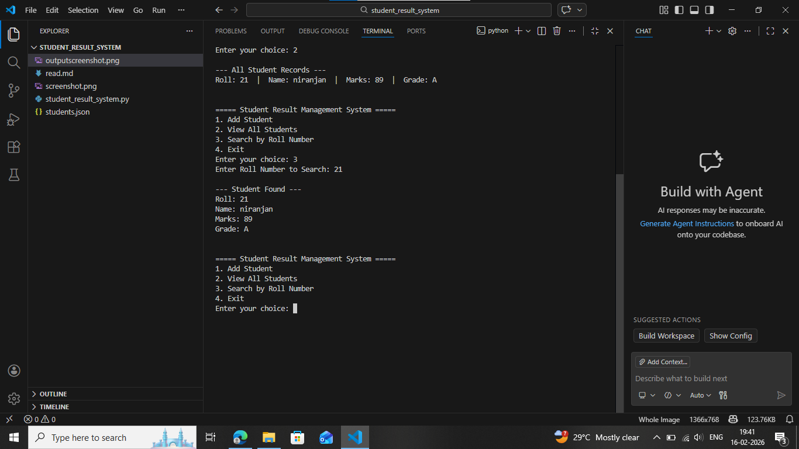

Implementation Logic 

This project is a Smart CLI-based Student Result Management System developed in Python using Object-Oriented Programming, file handling, and exception handling.

1. Class (OOP)

A Student class is created with attributes:

->roll number
->name
->marks
->grade

The class contains a function calculate_grade() which assigns grade based on marks.

2. File Handling

Student records are stored in a file students.json using:

2.1 load_data() -> to read data from file
2.2 save_data() -> to write data into file

3. Functions Used

3.1 add_student() -> Takes input and adds a new student
3.2 display_all_students() -> Shows all saved records
3.3 search_student() -> Searches student using roll number
3.4 menu() → Displays the options and runs the program in a loop

4. Exception Handling

try–except blocks are used for:

-> invalid inputs

-> file not found

-> JSON file errors

5. CLI Menu System

5.1 The program runs in a loop until the user chooses Exit, making it a user-friendly Smart CLI application.

screenshot

